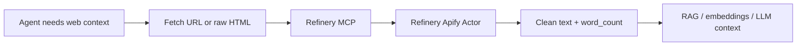

# Refinery MCP

Clean HTML before your agent burns tokens.

[Landing page](https://larelabs.github.io/refinery-mcp/) · [Apify Actor](https://apify.com/larelabs/refinery-html-to-llm-cleaner)

<!-- mcp-name: io.github.LareLabs/refinery-mcp -->

Refinery MCP wraps the [Refinery Apify Actor](https://apify.com/larelabs/refinery-html-to-llm-cleaner) as an MCP server so Claude, Cursor, and other agents can turn raw HTML or URLs into clean LLM-ready text plus `word_count`.




## The Problem

Agents are getting good at fetching web pages. The problem is what they fetch:

```html
<html>
  <head>
    <script>gtag("event", "page_view")</script>
    <style>.nav,.cookie,.footer{display:block}</style>
  </head>
  <body>
    <nav>Home · Pricing · Login · Docs · Blog · Careers</nav>
    <aside>Subscribe to our newsletter</aside>
    <article>
      <h1>How ACME cut support ticket routing time by 63%</h1>
      <p>ACME routes 40,000 monthly support tickets through an AI triage system.</p>
      <p>The team reduced retrieval noise by cleaning HTML before chunking.</p>
    </article>
    <footer>Legal · Privacy · Cookie settings · LinkedIn · X</footer>
  </body>
</html>
```

The model does not need most of that. It needs this:

```text
How ACME cut support ticket routing time by 63%

ACME routes 40,000 monthly support tickets through an AI triage system.
The team reduced retrieval noise by cleaning HTML before chunking.
```


Refinery MCP gives your agent a tool for that middle step:

```text
fetch page -> refine HTML -> send clean text to RAG / embeddings / LLM
```

## Why

Agents can fetch pages, but raw HTML is noisy and expensive:

- scripts, styles, tracking tags
- nav, footers, cookie banners
- repeated links and layout markup
- huge token burn before the model sees the real content

Refinery is the middle step your agent can call before it stuffs web context into a prompt:

```text
fetch/render -> clean/refine -> chunk/embed/answer
```

It is **not a crawler**. Use Firecrawl, Crawl4AI, Playwright, browser automation, or your own fetcher when you need rendering. Use Refinery when you already have a URL or raw HTML and want a cheap cleanup pass before the LLM.

## When To Use It

Use Refinery MCP when:

- your agent already fetched a page but got bloated HTML
- you want a deterministic cleanup step before RAG ingestion
- you need `word_count` / token-ish savings before embedding
- you want to separate crawling from content cleanup

Do not use it as your browser renderer, anti-bot layer, or site crawler.

## Tools

### `clean_url`

Fetches a URL through the Refinery Apify Actor and returns dataset rows with clean text and metadata.

Example input:

```json
{
  "url": "https://docs.stripe.com/payments",
  "removeScripts": true,
  "removeStyles": true
}
```

### `clean_html`

Cleans raw HTML your agent, crawler, or browser session already fetched.

Example input:

```json
{
  "html": "<html><body><nav>Home Pricing Login</nav><article><h1>Vendor security update</h1><p>We now support SOC 2 exports for enterprise accounts.</p></article><footer>Legal Privacy Careers</footer></body></html>",
  "extractMentions": false,
  "extractHashtags": false
}
```

Example result:

```json
{
  "text": "Vendor security update\n\nWe now support SOC 2 exports for enterprise accounts.",
  "word_count": 10,
  "content_type": "web",
  "language": "en",
  "processing_time_ms": 44.96,
  "success": true
}
```

### `estimate_savings`

Local helper that compares raw HTML vs cleaned text and estimates token savings. This does not call Apify.

Example output:

```json
{
  "raw_chars": 168,
  "clean_chars": 41,
  "estimated_raw_tokens": 42,
  "estimated_clean_tokens": 11,
  "estimated_token_savings": 31,
  "reduction_pct": 76
}
```

## Install

```bash
npx -y @larelabs/refinery-mcp
```

Set your Apify token:

```bash
export APIFY_TOKEN=apify_api_xxx
export REFINERY_ACTOR_ID=larelabs/refinery-html-to-llm-cleaner
```

## Cursor / Claude Desktop config

Use the published package:

```json
{
  "mcpServers": {
    "refinery": {
      "command": "npx",
      "args": ["-y", "@larelabs/refinery-mcp"],
      "env": {
        "APIFY_TOKEN": "apify_api_xxx",
        "REFINERY_ACTOR_ID": "larelabs/refinery-html-to-llm-cleaner"
      }
    }
  }
}
```

Or run from source during development:

```bash
git clone https://github.com/LareLabs/refinery-mcp
cd refinery-mcp
npm install
npm run build
```

```json
{
  "mcpServers": {
    "refinery": {
      "command": "npm",
      "args": ["run", "dev", "--prefix", "/absolute/path/to/refinery-mcp"],
      "env": {
        "APIFY_TOKEN": "apify_api_xxx"
      }
    }
  }
}
```

## Smoke Test

```bash
npm run build
APIFY_TOKEN=apify_api_xxx npm run smoke
```

The smoke test starts the MCP server over stdio, lists tools, and calls `estimate_savings` without spending Apify credits.

## Example Agent Prompt

```text
Use Refinery MCP to clean this docs page before summarizing it:
https://docs.stripe.com/payments

Return the clean text, word_count, and a short summary. Do not summarize raw HTML.
```

Another useful prompt:

```text
I fetched this page HTML with Playwright. Use Refinery MCP clean_html before adding it to my RAG ingestion queue. Return the cleaned text and estimated token savings.
```

## Roadmap

- MCP registry listings
- Hosted HTTP/SSE MCP transport
- Batch URL cleanup tool
- Glama / PulseMCP / FindMCP / mcp.so listings
- Optional direct REST wrapper for RapidAPI
- Token savings benchmark page

## License

MIT
