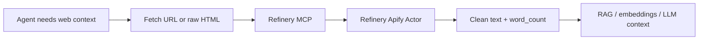

# Refinery MCP

Clean web HTML before your agent spends tokens on it.

Refinery MCP wraps the [Refinery Apify Actor](https://apify.com/larelabs/refinery-html-to-llm-cleaner) as an MCP server so Claude, Cursor, and other agents can turn raw HTML or URLs into clean LLM-ready text.



## Why

Agents can fetch pages, but raw HTML is noisy and expensive:

- scripts, styles, tracking tags
- nav, footers, cookie banners
- repeated links and layout markup
- huge token burn before the model sees the real content

Refinery is the middle step:

```text
fetch/render -> clean/refine -> chunk/embed/answer
```

It is **not a crawler**. Use Firecrawl, Crawl4AI, Playwright, browser automation, or your own fetcher when you need rendering. Use Refinery when you already have a URL or raw HTML and want a cheap cleanup pass before the LLM.

## Tools

### `clean_url`

Fetches a URL through the Refinery Apify Actor and returns dataset rows with clean text and metadata.

Input:

```json
{
  "url": "https://example.com",
  "removeScripts": true,
  "removeStyles": true
}
```

### `clean_html`

Cleans raw HTML your agent or crawler already fetched.

Input:

```json
{
  "html": "<html><body><nav>Home</nav><article><h1>Hello</h1><p>Clean me.</p></article></body></html>",
  "extractMentions": false,
  "extractHashtags": false
}
```

### `estimate_savings`

Local helper that compares raw HTML vs cleaned text and estimates token savings. This does not call Apify.

## Install

```bash
npm install
npm run build
```

Set your Apify token:

```bash
export APIFY_TOKEN=apify_api_xxx
export REFINERY_ACTOR_ID=larelabs/refinery-html-to-llm-cleaner
```

## Cursor / Claude Desktop config

Use the built server:

```json
{
  "mcpServers": {
    "refinery": {
      "command": "node",
      "args": ["/absolute/path/to/refinery-mcp/dist/index.js"],
      "env": {
        "APIFY_TOKEN": "apify_api_xxx",
        "REFINERY_ACTOR_ID": "larelabs/refinery-html-to-llm-cleaner"
      }
    }
  }
}
```

Or run from source during development:

```json
{
  "mcpServers": {
    "refinery": {
      "command": "npm",
      "args": ["run", "dev", "--prefix", "/absolute/path/to/refinery-mcp"],
      "env": {
        "APIFY_TOKEN": "apify_api_xxx"
      }
    }
  }
}
```

## Smoke Test

```bash
npm run build
APIFY_TOKEN=apify_api_xxx npm run smoke
```

The smoke test starts the MCP server over stdio, lists tools, and calls `estimate_savings` without spending Apify credits.

## Example Agent Prompt

```text
Use Refinery to clean this URL before summarizing it:
https://example.com

Return the clean text, word_count, and estimated token savings.
```

## Roadmap

- Hosted HTTP/SSE MCP transport
- Batch URL cleanup tool
- Glama / PulseMCP / FindMCP / mcp.so listings
- Optional direct REST wrapper for RapidAPI
- Token savings benchmark page

## License

MIT
